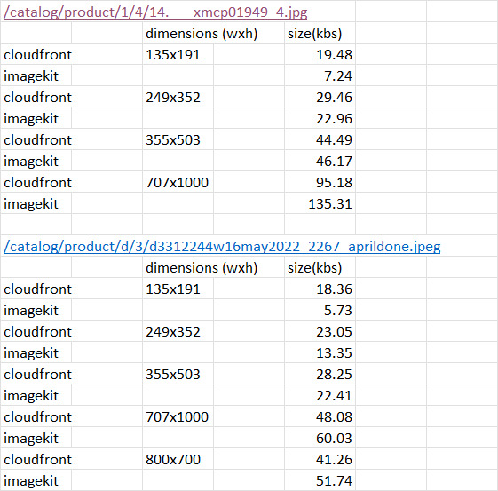
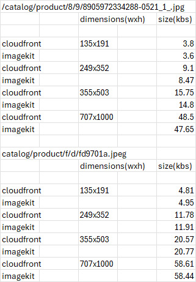
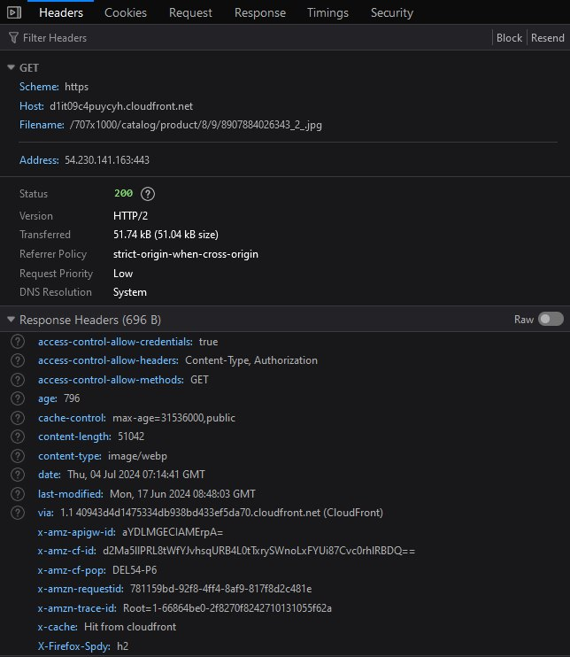

# On-the-Fly Image Resizing Tool

The goal of this project was to provide an on-the-fly image resizing tool for the ecommerce website [Lulu & Sky](https://www.luluandsky.com/). The tool needed to support resizing images stored in an S3 bucket and needed to be accessible via a URL format as shown below:

```
https://imgs7.luluandsky.com/catalog/product/3/2/325103-F11037BLACK_10036_1.jpg&h=352&w=249
```

where `https://imgs7.luluandsky.com/` is a subdomain registered for testing by the company, and `catalog/product/3/2/325103-F11037BLACK_10036_1.jpg` is the image path in the S3 bucket.

This project offers two solutions:

1. [Django API](#django-api)
2. [Customized AWS Solution](#customized-aws-solution)


## Django API

### Setup

1. **Start a virtual environment with Python 3.11**
   > Note: Elastic Beanstalk does not support Python 3.12 due to the removal of the `imp` module.

2. **Install dependencies**
   ```sh
   pip install -r requirements.txt
   ```

3. **Apply migrations**
   ```sh
   cd imagekit
   python manage.py migrate
   ```

4. **(Optional) Deploy the API using Elastic Beanstalk**
   Follow the steps in the [Elastic Beanstalk documentation](https://docs.aws.amazon.com/elasticbeanstalk/latest/dg/create-deploy-python-django.html#python-django-deploy).

### Usage

While running on localhost, you can call the API as follows:

```
apiendpoint/?url=<image_url>&w=<width>&h=<height>&q=<quality>
```

- `w` (width) and `h` (height) determine the scaling factor, with the larger dimension being the primary factor.
- `q` (quality) is optional, defaulting to 90%.

### Nginx Configuration

The Nginx configuration redirects requests to the Elastic Beanstalk URL in the required format mentioned above to the django server in the format expected by it:

```nginx
server {
    listen 80;
    server_name imagebag-dev.ap-south-1.elasticbeanstalk.com;
    location / {
        if ($request_uri ~* "^/(.+\.jpg)(.*)$") {
            rewrite ^/(.+\.jpg)(.*)$ /resize/?url=https://<bucket_name>.s3.amazonaws.com/$1$2 break;
        }
        proxy_pass http://127.0.0.1:8000;
        proxy_set_header Host $host;
        proxy_set_header X-Real-IP $remote_addr;
        proxy_set_header X-Forwarded-For $proxy_add_x_forwarded_for;
        proxy_set_header X-Forwarded-Proto $scheme;
    }
}
```
to achieve the required url mentioned above:
- `server_name` can be changed to the registered subdomain.
- `proxy_pass` can be changed to the Elastic Beanstalk URL to redirect requests from the subdomain to the Django server.
- Route 53 can be used to configure the DNS settings to point the subdomain to the elastic beasntalk endpoint.

For more information on configuring your Elastic Beanstalk environment, see the [documentation](https://docs.aws.amazon.com/elasticbeanstalk/latest/dg/platforms-linux-extend.html).

## Customized AWS Solution

This solution customizes the [AWS Serverless Image Handler](https://github.com/aws-solutions/serverless-image-handler) to meet specific requirements.

### Setup

1. **Install Node.js and AWS CLI**

2. **Configure AWS CLI**

3. **Bootstrap CDK Environment**
   ```sh
   cd serverless-image-handler-main/source/constructs
   npm install rimraf
   npm run clean:install
   $env:overrideWarningsEnabled = "false"; npx cdk bootstrap --profile <PROFILE_NAME>
   ```

4. **Deploy the Stack**
   ```sh
   $env:overrideWarningsEnabled = "false"; npx cdk deploy --parameters DeployDemoUIParameter=No --parameters SourceBucketsParameter=toberesized --profile default
   ```

   - `MY_BUCKET`: name of an existing bucket in your account.
   - `PROFILE_NAME`: name of an AWS CLI profile with appropriate credentials for deployment in your preferred region.
     - To see the names of profiles, run: `aws configure list-profiles`
     - By default, the profile name is `default`.

Monitor the output for any errors or warnings during the CloudFormation stack deployment.

For detailed architectural insights into this solution, visit the [Serverless Image Handler solution page](https://docs.aws.amazon.com/solutions/latest/serverless-image-handler/solution-overview.html).

### Changes Made

- Removed metadata from the output image.
- Set the output image and `Content-Type` response header to `webp` for all image calls.
- Made the deployment system-agnostic (replaced `rm -rf` with `rimraf` to support both Linux and Windows).

### Usage

API calls are formatted as follows:

```
https://d3lr2v3ps5vtcr.cloudfront.net/100x100/catalog/product/3/2/325103-F11037BLACK_10036_1.jpg
```

- `https://d3lr2v3ps5vtcr.cloudfront.net` is the CloudFront endpoint provided by CloudFormation.
- `/100x100/` specifies the required dimensions.
- `catalog/product/3/2/325103-F11037BLACK_10036_1.jpg` is the image path in the S3 bucket.

 To use the testing subdomain, Route 53 needs to be configured to point the subdomain to the the CloudFront distribution.

 ## Why the Customized AWS Solution?

The customized AWS solution leverages Lambda functions and CloudFront as a CDN to provide resized images with significantly reduced load times. This approach addresses scalability and performance issues inherent in traditional server-based image processing. By using serverless architecture, we offload the image resizing task to AWS Lambda, which scales automatically with demand, ensuring high availability and reliability. CloudFront further optimizes the delivery by caching the resized images at edge locations closer to users, resulting in faster load times and a better user experience on the Lulu & Sky website. This combination of technologies ensures efficient, on-the-fly image processing while minimizing server load and operational overhead.

## Process of Replacing the Existing ImageKit Solution

The company was using ImageKit for image resizing, but they sought a new solution that could match or surpass ImageKit in performance, particularly in file size and load times. Here's the process I went through to develop a solution that could replace ImageKit.

### Initial Django API Solution

1. **File Size Issue**:
   - The initial issue with the Django API was that the file sizes of resized images were larger than those produced by ImageKit at most resolutions.
   - **Solution**: I resolved this by changing the sampling method in the Pillow library from `LANCZOS` to `HAMMING`, which significantly reduced the file sizes to be comparable with ImageKit's outputs.

2. **Load Time Issue**:
   - When hosted on Elastic Beanstalk, the load times were unacceptably high.
   - **Solution**: To address this, I switched to using the AWS solution, which utilizes Lambda functions and CloudFront CDN.

### Customized AWS Solution

1. **Initial Deployment**:
   - I first deployed the AWS Serverless Image Handler solution without any customization. The combination of Lambda functions and CloudFront CDN greatly reduced the load times compared to the Django API.
   - However, the file sizes for smaller dimensions were still significantly larger than ImageKit's output.

2. **Metadata Issue**:
   - I identified that the increased file size was due to the extensive metadata attached to the output images by the AWS solution, unlike ImageKit, which stripped the metadata.
   
   

   - **Testing Hypothesis**: I used ExifTool to compare the metadata size of the original image with the resized image, confirming that the metadata significantly increased the file size. Note that the dimensions of both the images are exactly the same, i just wanted to test the affect of the resizing function on the image.

   ```sh
   PS > $exifData = & exiftool -s -j "\original.jpg"
   PS > $size = [System.Text.Encoding]::UTF8.GetByteCount($exifData)
   PS > Write-Output "Size of EXIF metadata: $size bytes"
   Size of EXIF metadata: 801 bytes

   PS > $exifData = & exiftool -s -j "\resized.jpg"
   PS > $size = [System.Text.Encoding]::UTF8.GetByteCount($exifData)
   PS > Write-Output "Size of EXIF metadata: $size bytes"
   Size of EXIF metadata: 5402 bytes
   ```

4. **Customizing the AWS Solution**:
   - I tweaked the `instantiateSharpImage` method, which is called in the `process` method in `image-handler.ts`, to strip metadata from the output images.
   - **Result**: This made the solution's output file sizes comparable to ImageKit.
   
   

5. **Further Optimization**:
   - I further improved the load times by changing the default output format to `webp` when no format is specified, modifying the `modifyImageOutput` function in `image-handler.ts`.
   - **Content-Type Header**: The image's metadata would indicate `File:FileTypeWEBP`, but the response header had the original format. I hardcoded the `Content-Type` header to `image/webp` in `image-handler.ts` to ensure consistency, which in hindsight, i realize is not the optimal solution.

With these modifications, the new solution became comparable to ImageKit in terms of both file size and load times, providing an efficient and scalable alternative for the company's image resizing needs.

## Customizing CloudFront Distribution

### Use Case

The company sends GET requests to the CloudFormation output API to retrieve product images from an S3 bucket and resize them on the fly to a select set of dimensions. This is how all the item images are listed on the website.



The following configuration changes are based on my specific use case, but they might vary for other scenarios.

### Configuration Changes

Aside from the default settings, here are the changes I made:

1. **Price Class**:
   - **Setting**: Price Class All
   - **Reason**: Includes all CloudFront locations, ensuring global delivery. You can change this according to your userbase. See the regions included in different classes [here](https://aws.amazon.com/cloudfront/pricing/).

2. **Edit Behavior**:
   - **Compression**: Enabled
     - **Reason**: Since we're delivering static media content (images), enabling compression helps reduce load times.
   - **HTTP Methods**: Only allowing GET, HEAD
     - **Reason**: Our use case is solely retrieving images from the database.

3. **Cache Key and Origin Request**:
   - **Default Cache Policy Changes**:
     - **Default TTL**: Increased to one year
       - **Reason**: The images are rarely modified, so we want them to be stored at the edge cache for as long as possible. While our application doesn’t send request headers regarding caching age, the default TTL will dictate the caching behavior for the edge cache. Alternatively, you can use cache-control headers to instruct CloudFront on how to cache the requested image, within the max/min-TTL defined in the console.
   - **Cache Key Settings**:
     - **Removed Accept Header**
       - **Reason**: This header differs for every browser, and removing it helps achieve a higher cache hit/miss ratio. The fewer headers and query strings included, the shorter the cache key, resulting in a better cache hit/miss ratio due to the reduced likelihood of differing requests. Read more in the [CloudFront documentation](https://docs.aws.amazon.com/AmazonCloudFront/latest/DeveloperGuide/understanding-the-cache-key.html).
     - **Query Strings and Cookie Settings**: Left unchanged as we are not using any query strings in our url call.
   - **Origin Policy**: Left unchanged as it does not impact load times or caching.

4. **Response Header Policy**:
   - **Usage**: Not used
   - **Reason**: Not needed for our use, you can learn more about response headers [here](https://docs.aws.amazon.com/AmazonCloudFront/latest/DeveloperGuide/modifying-response-headers.html).

5. **Edit Origin**:
   - **Origin Shield**: Enabled
     - **Reason**: Origin Shield acts as an additional caching layer between the regional edge caches and the origin, improving cache availability and hit/miss ratio. Choosing the correct region for your Origin Shield balances cost and performance.

### Origin Shield Flow

**Without Origin Shield**:


**With Origin Shield**:


**Origin Shield Configuration**:
- **Region**: ap-south-1 (Mumbai)
  - **Reason**: Our origin server is located in us-east-1, and our main userbase is in India. Placing the Origin Shield in the same region as the regional edge cache (ap-south-1) ensures improved performance for a small number of requests for the userbase in India and a significant performance increase for nearby regions. Requests from the Mumbai(ap-sout-1) edge cache, which serves the majority of our users, are free when routed through the Origin Shield in the same region as origin shield doesnt charge you for making get requests that naturally go to the regional edge cache in the same region as Origin Shield. However, AWS recommends to choose the AWS Region for your origin shield that has the lowest latency to your origin. See the available regions and AWS recommendations [here](https://docs.aws.amazon.com/AmazonCloudFront/latest/DeveloperGuide/origin-shield.html#choose-origin-shield-region). You can use [this map](https://aws.amazon.com/cloudfront/features/?whats-new-cloudfront.sort-by=item.additionalFields.postDateTime&whats-new-cloudfront.sort-order=desc#Global_Edge_Network) to inspect the cloudfront Edge Locations, Embedded POPs, Regional Edge Caches in different regions.

More information about Origin Shield pricing is available [here](https://docs.aws.amazon.com/AmazonCloudFront/latest/DeveloperGuide/origin-shield.html#origin-shield-costs).

These changes ensure that the solution is optimized for performance and cost-effectiveness, meeting the specific needs of the company's image delivery system.
